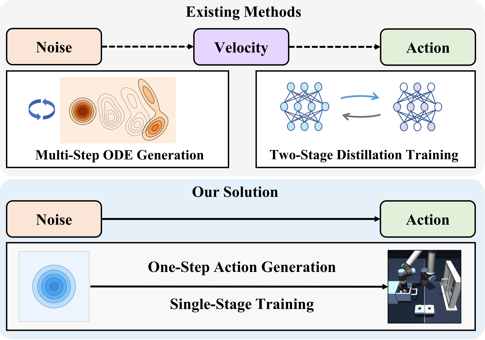

# One-Step Generative Policies with Q-Learning: A Reformulation of MeanFlow
[](https://aaai.org/)
[](https://arxiv.org/abs/2511.13035)

<p align="center">
  
</p>


## Setup

### Environment Setup

```bash
conda env create -f environment.yml
conda activate flowrl
```

### Dataset Setup

```bash
python download_all_datasets.py
```

OGBench datasets are stored in `./dataset`. Run download and training commands
from the repository root.

## Native MeanFlow

This repository also contains an isolated native MeanFlow baseline. Unlike the
original `agents/meanflowql.py` endpoint reformulation, the native agent learns
the interval-average velocity `u(o, x_t, r, t)` and its MeanFlow JVP target. It
supports behavior-only training, one-step Direct-Q, an EMA target actor,
best-of-N actions, and K-step reverse transport diagnostics.

Implementation and tests:

```text
agents/native_meanflow.py
utils/native_meanflow.py
tests/test_native_meanflow.py
tests/test_native_meanflow_agent.py
```

The full derivation, experimental protocol, checkpoint workflow, comparison
matrix, and troubleshooting guide are in
[docs/NATIVE_MEANFLOW_EXPERIMENT.md](docs/NATIVE_MEANFLOW_EXPERIMENT.md).

### Run the tests

```bash
python -m pytest -q \
  tests/test_native_meanflow.py \
  tests/test_native_meanflow_agent.py
```

### Minimal smoke run

```bash
MUJOCO_GL=egl python main_meanflowql.py \
  --run_group=native_meanflow_smoke \
  --env_name=cube-triple-play-singletask-task2-v0 \
  --agent=agents/native_meanflow.py \
  --seed=0 \
  --offline_steps=20 \
  --online_steps=0 \
  --log_interval=5 \
  --eval_interval=0 \
  --save_interval=20 \
  --enable_early_stopping=False \
  --wandb_online=False \
  --agent.batch_size=32 \
  --agent.num_candidates=1
```

### Behavior-only native MeanFlow

Set all RL and action-bound coefficients to zero so only the native MeanFlow
identity updates the actor:

```bash
MUJOCO_GL=egl python main_meanflowql.py \
  --run_group=native_meanflow_sft \
  --env_name=cube-triple-play-singletask-task2-v0 \
  --agent=agents/native_meanflow.py \
  --seed=0 \
  --offline_steps=1000000 \
  --online_steps=0 \
  --eval_interval=100000 \
  --save_interval=100000 \
  --enable_early_stopping=False \
  --wandb_online=True \
  --agent.meanflow_coef=1.0 \
  --agent.q_coef=0.0 \
  --agent.critic_coef=0.0 \
  --agent.bound_loss_weight=0.0 \
  --agent.num_candidates=1
```

### Native MeanFlow with Direct-Q

```bash
MUJOCO_GL=egl python main_meanflowql.py \
  --run_group=native_meanflow_direct_q \
  --env_name=cube-triple-play-singletask-task2-v0 \
  --agent=agents/native_meanflow.py \
  --seed=0 \
  --offline_steps=1000000 \
  --online_steps=0 \
  --pretrain_factor=0.1 \
  --eval_interval=100000 \
  --save_interval=100000 \
  --wandb_online=True \
  --agent.meanflow_coef=10.0 \
  --agent.q_coef=1.0 \
  --agent.critic_coef=1.0 \
  --agent.num_candidates=5
```

The original MeanFlowQL files and checkpoint structure are unchanged. Native
MeanFlow actor checkpoints are not interchangeable with original MeanFlowQL
actor checkpoints.

## AM-MF on Native MeanFlow

Two isolated AM-MF versions are provided. The first keeps the original AM/Note
target on the Native MeanFlow actor. The second adapts AM to this repository's
existing MeanFlowQL reformulation and injects the endpoint-Q adjoint into the
reformulated direct-map target.

| Version | Agent | Target |
| --- | --- | --- |
| Original AM-MF target | `agents/am_meanflow.py` | `u_pre + eta*(t-s)*lambda`, followed by the AlphaFlow mixture |
| AM-guided MeanFlowQL target | `agents/am_meanflow_target_changed.py` | `g_tgt=x_t+(t-1)v_AM-t D_t^[v_AM]g`, where `v_AM=v-eta*t*lambda` |

The changed version subclasses `MeanFlowQL_Agent`, keeps its three-input direct
map `g(o,x_t,t)` and one-step sampler `g(o,epsilon,1)`, and exactly recovers the
original MeanFlowQL target when `adjoint_eta=0`. It is neither a Native JVP
variant nor the earlier `u_pre+eta*lambda` interval-scaling ablation.

Implementation and tests:

```text
agents/am_meanflow.py
agents/am_meanflow_target_changed.py
utils/am_meanflow.py
tests/test_am_meanflow.py
tests/test_am_meanflow_agent.py
tests/test_am_meanflow_target_changed.py
```

The shared principles and paired-comparison protocol are in
[docs/AM_MF_INTRODUCTION.md](docs/AM_MF_INTRODUCTION.md). The two targets have
separate documentation:

- [Original AM-MF target](docs/AM_MF_ORIGINAL_TARGET.md)
- [AM-guided MeanFlowQL reformulated target](docs/AM_MF_CHANGED_TARGET.md)

### Run AM-MF and Native regression tests

```bash
python -m pytest -q \
  tests/test_native_meanflow.py \
  tests/test_native_meanflow_agent.py \
  tests/test_am_meanflow.py \
  tests/test_am_meanflow_agent.py \
  tests/test_am_meanflow_target_changed.py
```

### Original AM-MF target smoke run

```bash
MUJOCO_GL=egl python main_meanflowql.py \
  --run_group=am_mf_original_target_smoke \
  --env_name=cube-triple-play-singletask-task2-v0 \
  --agent=agents/am_meanflow.py \
  --seed=0 \
  --offline_steps=20 \
  --online_steps=0 \
  --pretrain_factor=0.5 \
  --log_interval=5 \
  --eval_interval=0 \
  --save_interval=20 \
  --enable_early_stopping=False \
  --wandb_online=False \
  --agent.batch_size=32 \
  --agent.alpha_mode=fixed \
  --agent.alpha_value=0.5 \
  --agent.num_candidates=1
```

### AM-guided MeanFlowQL target smoke run

```bash
MUJOCO_GL=egl python main_meanflowql.py \
  --run_group=am_meanflowql_reformulated_smoke \
  --env_name=cube-triple-play-singletask-task2-v0 \
  --agent=agents/am_meanflow_target_changed.py \
  --seed=0 \
  --offline_steps=20 \
  --online_steps=0 \
  --pretrain_factor=0.5 \
  --log_interval=5 \
  --eval_interval=0 \
  --save_interval=20 \
  --enable_early_stopping=False \
  --wandb_online=False \
  --agent.batch_size=32 \
  --agent.adjoint_eta=0.1 \
  --agent.meanflowql_direct_q_coef=0.0 \
  --agent.num_candidates=1 \
  --agent.action_mode=normal
```

Each agent fixes its own target contract: `am_meanflow.py` accepts only
`note_average`, while `am_meanflow_target_changed.py` accepts only
`meanflowql_reformulated_adjoint`. The original version's `alpha` controls the
AlphaFlow mixture. The changed version's inherited `alpha` is MeanFlowQL's
MFI/BC coefficient; its AM strength is `adjoint_eta`. Direct-Q is disabled in
the changed version by default because Q already enters through the adjoint;
setting `meanflowql_direct_q_coef>0` creates an explicit hybrid ablation.

## Toy Experiments

```bash
python toy_example/verify_fql_flow_fit.py
python toy_example/verify_meanflow_uat.py
```

If you wish to evaluate the performance of our different variants on the toy example, please modify the training objective in the `meanflow_loss` section and the action sampling logic in the `sample_action` function within the `meanflowql_beta.py` file accordingly.

## Offline Experiments

```bash
Example:
python main_meanflowql.py --env_name=humanoidmaze-large-navigate-singletask-task1-v0 --agent=agents/meanflowql.py --agent.time_steps=50 --early_stopping_metric=evaluation/success --offline_steps=1000005 --early_stopping_patience=10 --proj_wandb=0726_humanoidmaze-large-navigate-singletask-task1-v0 --wandb_save_dir=07281632_meanflowRL_param_search --run_group=meanflow_param_search --seed=1 --agent.alpha=6000 --agent.discount=0.995 --agent.num_candidates=5 --wandb_online=True
```

## Offline to Online Experiments

```bash
Example:
python main_meanflowql.py --env_name=humanoidmaze-medium-navigate-singletask-task1-v0 --agent=agents/meanflowql.py --online_steps=1000000 --offline_steps=1000000 --proj_wandb=0729online-humanoidmaze-medium-navigate-singletask-task1-v0 --wandb_save_dir=meanflowRL_online --run_group=meanflow_online --seed=1 --early_stopping_patience=100 --wandb_online=True --agent.time_steps=100 --agent.alpha=2000 --agent.discount=0.995 --agent.num_candidates=5
```
## License
This project is released under the MIT License.
