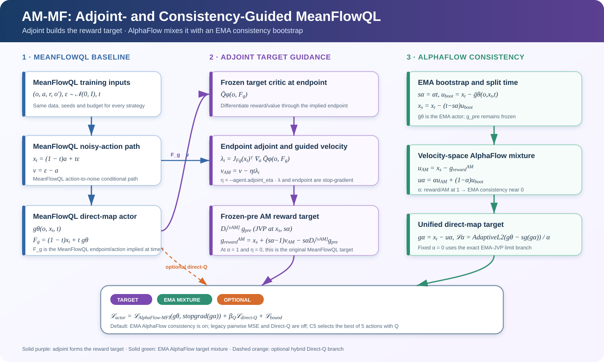

# One-Step Generative Policies with Q-Learning: A Reformulation of MeanFlow
[](https://aaai.org/)
[](https://arxiv.org/abs/2511.13035)

<p align="center">
  
</p>


## Setup

### Environment Setup

```bash
conda env create -f environment.yml
conda activate flowrl
```

### Dataset Setup

```bash
python download_all_datasets.py
```

OGBench datasets are stored in `./dataset`. Run download and training commands
from the repository root.

## How adjoint and consistency enter MeanFlowQL

The current primary AM-MF variant keeps MeanFlowQL's direct-map actor
$g_\theta(o,x_t,t)$ and changes the regression target rather than replacing
the policy architecture. Its implied action endpoint is

$$
F_g(o,x_t,t)=(1-t)x_t+t\,g_\theta(o,x_t,t).
$$

The target critic differentiates through this endpoint to produce the stopped
adjoint

$$
\lambda_t
=J_{F_g}(x_t)^{\mathsf T}
\nabla_a\bar Q_\phi\!\left(o,F_g(o,x_t,t)\right),
\qquad
v_{\mathrm{AM}}=v-\eta t\lambda_t.
$$

Here $\eta$ is controlled by `--agent.adjoint_eta`. The complete changed-target
agent has a frozen pre actor and an EMA target actor. In MeanFlowQL's
action-to-noise convention, AlphaFlow first uses the EMA direct map to split
the path:

$$
s_\alpha=\alpha_{\mathrm{AF}}t,
\qquad
u_{\mathrm{boot}}=x_t-g_{\bar\theta}(o,x_t,t),
\qquad
x_s=x_t-(t-s_\alpha)u_{\mathrm{boot}}.
$$

At $(x_s,s_\alpha)$, the frozen pre actor supplies the JVP along
$v_{\mathrm{AM}}$ and produces the AM reward target:

$$
g_{\mathrm{reward}}^{\mathrm{AM}}
=x_s+(s_\alpha-1)v_{\mathrm{AM}}
-s_\alpha D_t^{[v_{\mathrm{AM}}]}g_{\mathrm{pre}}.
$$

The Note/AlphaFlow consistency mechanism then mixes this reward velocity with
the EMA bootstrap velocity and maps it back to MeanFlowQL's direct-map target:

$$
u_{\mathrm{reward}}^{\mathrm{AM}}=x_s-g_{\mathrm{reward}}^{\mathrm{AM}},
\qquad
u_\alpha=\alpha_{\mathrm{AF}}u_{\mathrm{reward}}^{\mathrm{AM}}
+(1-\alpha_{\mathrm{AF}})u_{\mathrm{boot}},
\qquad
g_\alpha=x_t-u_\alpha.
$$

`alpha_AF=1` selects the pure AM changed target; fixed `alpha_AF=0` activates
the exact EMA-JVP consistency limit. The inherited `--agent.alpha` remains
MeanFlowQL's outer MFI/BC loss weight, while the separate
`--agent.alphaflow_alpha_*` parameters control target mixing. The older
pairwise endpoint MSE is only an optional extra ablation through
`--agent.consistency_alpha>0` and is disabled by default.

Q enters through the adjoint target by default;
`--agent.meanflowql_direct_q_coef=0` disables the additional direct-Q actor
gradient, while a positive value deliberately creates a hybrid ablation. Full
derivations are in
[docs/AM_MF_INTRODUCTION.md](docs/AM_MF_INTRODUCTION.md) and
[docs/AM_MF_CHANGED_TARGET.md](docs/AM_MF_CHANGED_TARGET.md).

## `small_scale_validation` run guide

The small-scale validation uses two complementary tasks:

| Task | Metric | MeanFlowQL paper result |
| --- | --- | ---: |
| `humanoidmaze-large-navigate-singletask-task1-v0` | success | offline C5: `53 +/- 5` |
| `relocate-cloned-v1` | D4RL normalized return | C5: `1 +/- 1 -> 19 +/- 8` |

The paper configuration for both tasks is `alpha=10000`,
`num_candidates=5`, and `time_steps=50`. The paper does not report C1 values,
and it does not report a task-specific online value for HumanoidMaze Large
Task1; C1 and Humanoid online runs are diagnostics rather than paper numbers.

Run from the repository root:

```bash
# MeanFlowQL paper-style baseline: offline and offline-to-online.
bash scripts/small_scale_validation/run_humanoidmaze_large_task1.sh offline 1
bash scripts/small_scale_validation/run_humanoidmaze_large_task1.sh online 1

bash scripts/small_scale_validation/run_relocate_cloned.sh offline 1
bash scripts/small_scale_validation/run_relocate_cloned.sh online 1
```

The scripts default to `agents/meanflowql.py`, C5, local W&B logging, and no
early stopping. Change the strategy without editing either script by passing
the agent path and its existing config names:

```bash
# AM embedded in the MeanFlowQL target; no extra direct-Q actor gradient.
AGENT_PATH=agents/am_meanflow_target_changed.py \
EXTRA_AGENT_FLAGS='--agent.adjoint_eta=0.1 --agent.alphaflow_alpha_mode=anneal --agent.alphaflow_alpha_floor=0.05 --agent.meanflowql_direct_q_coef=0.0' \
bash scripts/small_scale_validation/run_humanoidmaze_large_task1.sh offline 1

# A C1 diagnostic. This changes the training/sampling protocol and is not a
# paper-reported result.
NUM_CANDIDATES=1 \
bash scripts/small_scale_validation/run_relocate_cloned.sh offline 1
```

The important strategy parameters are:

| Purpose | Parameter |
| --- | --- |
| Select implementation | `AGENT_PATH=agents/meanflowql.py`, `agents/native_meanflow.py`, `agents/am_meanflow.py`, or `agents/am_meanflow_target_changed.py` |
| Adjoint strength | `--agent.adjoint_eta` |
| AlphaFlow target mixture | `--agent.alphaflow_alpha_mode`, `--agent.alphaflow_alpha_value`, `--agent.alphaflow_alpha_floor` |
| EMA target update | `--agent.alphaflow_target_tau` |
| Optional legacy pairwise loss | `--agent.consistency_alpha` |
| Optional hybrid Direct-Q | `--agent.meanflowql_direct_q_coef` |
| Candidate count C1/C5 | `NUM_CANDIDATES=1` or `5` / `--agent.num_candidates` |
| Paper BC/MFI coefficient | `ALPHA` / `--agent.alpha` |
| MeanFlowQL time grid | `TIME_STEPS` / `--agent.time_steps` |
| Training budgets | `OFFLINE_STEPS` and `ONLINE_STEPS` |

The scripts launch training only; no generated result is tracked by Git. See
[docs/SMALL_SCALE_VALIDATION.md](docs/SMALL_SCALE_VALIDATION.md) for the D4RL
budget note, exact defaults, all strategy parameter names, and the C1/C5
interpretation.

## Native MeanFlow

This repository also contains an isolated native MeanFlow baseline. Unlike the
original `agents/meanflowql.py` endpoint reformulation, the native agent learns
the interval-average velocity `u(o, x_t, r, t)` and its MeanFlow JVP target. It
supports behavior-only training, one-step Direct-Q, an EMA target actor,
best-of-N actions, and K-step reverse transport diagnostics.

Implementation and tests:

```text
agents/native_meanflow.py
utils/native_meanflow.py
tests/test_native_meanflow.py
tests/test_native_meanflow_agent.py
```

The full derivation, experimental protocol, checkpoint workflow, comparison
matrix, and troubleshooting guide are in
[docs/NATIVE_MEANFLOW_EXPERIMENT.md](docs/NATIVE_MEANFLOW_EXPERIMENT.md).

### Run the tests

```bash
python -m pytest -q \
  tests/test_native_meanflow.py \
  tests/test_native_meanflow_agent.py
```

### Minimal smoke run

```bash
MUJOCO_GL=egl python main_meanflowql.py \
  --run_group=native_meanflow_smoke \
  --env_name=cube-triple-play-singletask-task2-v0 \
  --agent=agents/native_meanflow.py \
  --seed=0 \
  --offline_steps=20 \
  --online_steps=0 \
  --log_interval=5 \
  --eval_interval=0 \
  --save_interval=20 \
  --enable_early_stopping=False \
  --wandb_online=False \
  --agent.batch_size=32 \
  --agent.num_candidates=1
```

### Behavior-only native MeanFlow

Set all RL and action-bound coefficients to zero so only the native MeanFlow
identity updates the actor:

```bash
MUJOCO_GL=egl python main_meanflowql.py \
  --run_group=native_meanflow_sft \
  --env_name=cube-triple-play-singletask-task2-v0 \
  --agent=agents/native_meanflow.py \
  --seed=0 \
  --offline_steps=1000000 \
  --online_steps=0 \
  --eval_interval=100000 \
  --save_interval=100000 \
  --enable_early_stopping=False \
  --wandb_online=True \
  --agent.meanflow_coef=1.0 \
  --agent.q_coef=0.0 \
  --agent.critic_coef=0.0 \
  --agent.bound_loss_weight=0.0 \
  --agent.num_candidates=1
```

### Native MeanFlow with Direct-Q

```bash
MUJOCO_GL=egl python main_meanflowql.py \
  --run_group=native_meanflow_direct_q \
  --env_name=cube-triple-play-singletask-task2-v0 \
  --agent=agents/native_meanflow.py \
  --seed=0 \
  --offline_steps=1000000 \
  --online_steps=0 \
  --pretrain_factor=0.1 \
  --eval_interval=100000 \
  --save_interval=100000 \
  --wandb_online=True \
  --agent.meanflow_coef=10.0 \
  --agent.q_coef=1.0 \
  --agent.critic_coef=1.0 \
  --agent.num_candidates=5
```

The original MeanFlowQL files and checkpoint structure are unchanged. Native
MeanFlow actor checkpoints are not interchangeable with original MeanFlowQL
actor checkpoints.

## AM-MF on Native MeanFlow

Two isolated AM-MF versions are provided. The first keeps the original AM/Note
target on the Native MeanFlow actor. The second adapts AM to this repository's
existing MeanFlowQL reformulation and injects the endpoint-Q adjoint into the
reformulated direct-map target.

| Version | Agent | Target |
| --- | --- | --- |
| Original AM-MF target | `agents/am_meanflow.py` | `u_pre + eta*(t-s)*lambda`, followed by the AlphaFlow mixture |
| AM-guided MeanFlowQL target | `agents/am_meanflow_target_changed.py` | AM reformulated reward target followed by AlphaFlow reward/EMA velocity mixture |

The changed version subclasses `MeanFlowQL_Agent`, keeps its three-input direct
map `g(o,x_t,t)` and one-step sampler `g(o,epsilon,1)`, and fully inherits the
Note/AlphaFlow frozen-pre, EMA-target, target-mixture, and exact-zero JVP
structure. At the `alpha_AF=1` boundary it exactly recovers the original
MeanFlowQL target when `adjoint_eta=0`. It is neither a Native JVP variant nor
the earlier `u_pre+eta*lambda` interval-scaling ablation.

Implementation and tests:

```text
agents/am_meanflow.py
agents/am_meanflow_target_changed.py
utils/am_meanflow.py
tests/test_am_meanflow.py
tests/test_am_meanflow_agent.py
tests/test_am_meanflow_target_changed.py
```

The shared principles and paired-comparison protocol are in
[docs/AM_MF_INTRODUCTION.md](docs/AM_MF_INTRODUCTION.md). The two targets have
separate documentation:

- [Original AM-MF target](docs/AM_MF_ORIGINAL_TARGET.md)
- [AM-guided MeanFlowQL reformulated target](docs/AM_MF_CHANGED_TARGET.md)

### Run AM-MF and Native regression tests

```bash
python -m pytest -q \
  tests/test_native_meanflow.py \
  tests/test_native_meanflow_agent.py \
  tests/test_am_meanflow.py \
  tests/test_am_meanflow_agent.py \
  tests/test_am_meanflow_target_changed.py \
  tests/test_consistency_eval.py
```

### Original AM-MF target smoke run

```bash
MUJOCO_GL=egl python main_meanflowql.py \
  --run_group=am_mf_original_target_smoke \
  --env_name=cube-triple-play-singletask-task2-v0 \
  --agent=agents/am_meanflow.py \
  --seed=0 \
  --offline_steps=20 \
  --online_steps=0 \
  --pretrain_factor=0.5 \
  --log_interval=5 \
  --eval_interval=0 \
  --save_interval=20 \
  --enable_early_stopping=False \
  --wandb_online=False \
  --agent.batch_size=32 \
  --agent.alpha_mode=fixed \
  --agent.alpha_value=0.5 \
  --agent.num_candidates=1
```

### AM-guided MeanFlowQL target smoke run

```bash
MUJOCO_GL=egl python main_meanflowql.py \
  --run_group=am_meanflowql_reformulated_smoke \
  --env_name=cube-triple-play-singletask-task2-v0 \
  --agent=agents/am_meanflow_target_changed.py \
  --seed=0 \
  --offline_steps=20 \
  --online_steps=0 \
  --pretrain_factor=0.5 \
  --log_interval=5 \
  --eval_interval=0 \
  --save_interval=20 \
  --enable_early_stopping=False \
  --wandb_online=False \
  --agent.batch_size=32 \
  --agent.adjoint_eta=0.1 \
  --agent.alphaflow_alpha_mode=anneal \
  --agent.alphaflow_alpha_floor=0.05 \
  --agent.alphaflow_target_tau=0.005 \
  --agent.meanflowql_direct_q_coef=0.0 \
  --agent.num_candidates=1 \
  --agent.action_mode=normal
```

Each agent fixes its own target contract: `am_meanflow.py` accepts only
`note_average`, while `am_meanflow_target_changed.py` accepts only
`meanflowql_reformulated_adjoint`. The original version's `alpha` controls the
AlphaFlow mixture. The changed version's inherited `alpha` is MeanFlowQL's
MFI/BC coefficient, its independent `alphaflow_alpha_*` parameters control the
reward/EMA target mixture, and its AM strength is `adjoint_eta`. Direct-Q is
disabled in the changed version by default because Q already enters through
the adjoint; setting `meanflowql_direct_q_coef>0` creates an explicit hybrid
ablation.

## Consistency evaluation

The repository includes one consistency evaluator for Native MeanFlow,
MeanFlowQL, and both AM-MF variants:

```text
consistency_eval.py
utils/consistency_eval.py
tests/test_consistency_eval.py
docs/CONSISTENCY_EVAL.md
```

It keeps the two parameterizations separate. Native MeanFlow agents are
checked with the interval split identity, endpoint-map consistency, and
endpoint Jacobian/JVP consistency. MeanFlowQL agents are checked through their
actual reformulated endpoint map, without inventing an unavailable native
interval velocity. K1-vs-KN errors and trajectory geometry are reported for
both families.

Run the evaluator from the repository root:

```bash
MUJOCO_GL=egl python consistency_eval.py \
  --run_dir=/absolute/path/to/run \
  --restore_epoch=1000000 \
  --validation_states=1024 \
  --noises_per_state=4 \
  --eval_seed=20260824 \
  --eval_nfes=1,2,4,10 \
  --trajectory_steps=10 \
  --inference_batch_size=256 \
  --jacobian_probe_pairs=128
```

The command restores the agent configuration and normalization protocol from
the run's `flags.json`, evaluates fixed state-noise pairs, and writes a JSON
report into the run directory. Optional `--max_*` arguments enable an explicit
binary judgement. No task-independent pass/fail thresholds are assumed.

See [docs/CONSISTENCY_EVAL.md](docs/CONSISTENCY_EVAL.md) for the formulas,
metric definitions, shared-probe protocol, thresholds, and comparison matrix.

## Toy Experiments

```bash
python toy_example/verify_fql_flow_fit.py
python toy_example/verify_meanflow_uat.py
```

If you wish to evaluate the performance of our different variants on the toy example, please modify the training objective in the `meanflow_loss` section and the action sampling logic in the `sample_action` function within the `meanflowql_beta.py` file accordingly.

## Offline Experiments

```bash
Example:
python main_meanflowql.py --env_name=humanoidmaze-large-navigate-singletask-task1-v0 --agent=agents/meanflowql.py --agent.time_steps=50 --early_stopping_metric=evaluation/success --offline_steps=1000005 --early_stopping_patience=10 --proj_wandb=0726_humanoidmaze-large-navigate-singletask-task1-v0 --wandb_save_dir=07281632_meanflowRL_param_search --run_group=meanflow_param_search --seed=1 --agent.alpha=6000 --agent.discount=0.995 --agent.num_candidates=5 --wandb_online=True
```

## Offline to Online Experiments

```bash
Example:
python main_meanflowql.py --env_name=humanoidmaze-medium-navigate-singletask-task1-v0 --agent=agents/meanflowql.py --online_steps=1000000 --offline_steps=1000000 --proj_wandb=0729online-humanoidmaze-medium-navigate-singletask-task1-v0 --wandb_save_dir=meanflowRL_online --run_group=meanflow_online --seed=1 --early_stopping_patience=100 --wandb_online=True --agent.time_steps=100 --agent.alpha=2000 --agent.discount=0.995 --agent.num_candidates=5
```
## License
This project is released under the MIT License.
